# Data Model: Voetbalpoule & Voorspelsysteem

## Design Goals

- Support multiple tournaments in one codebase.
- Keep scoring data-driven per competition and per section.
- Persist only final submissions; no partial persisted prediction records.
- Make standings reproducible through snapshot history.
- Preserve shared-hosting compatibility with a straightforward MySQL schema.

## Entity Relationship Overview

```mermaid
erDiagram
    USERS ||--o{ COMPETITION_PARTICIPANTS : enrolls
    USERS ||--o{ ADMIN_AUDIT_LOG : performs
    COMPETITIONS ||--o{ COMPETITION_SECTIONS : contains
    COMPETITIONS ||--o{ COMPETITION_RULES : configures
    COMPETITIONS ||--o{ COMPETITION_PARTICIPANTS : has
    COMPETITIONS ||--o{ MATCHES : schedules
    COMPETITIONS ||--o{ BONUS_QUESTIONS : asks
    COMPETITIONS ||--o{ PREDICTION_SUBMISSIONS : receives
    COMPETITIONS ||--o{ SUB_COMPETITIONS : groups
    COMPETITIONS ||--o{ STANDINGS_SNAPSHOTS : records
    COMPETITIONS ||--o{ KNOCKOUT_ROUNDS : defines
    SUB_COMPETITIONS ||--o{ SUB_COMPETITION_MEMBERS : includes
    SUB_COMPETITIONS ||--o{ STANDINGS_SNAPSHOTS : records
    KNOCKOUT_ROUNDS ||--o{ KNOCKOUT_ROUND_TEAMS : contains
    CATALOG_ENTITIES ||--o{ KNOCKOUT_ROUND_TEAMS : assigns
    GROUPS ||--o{ MATCHES : classifies
    VENUES ||--o{ MATCHES : hosts
    CATALOG_ENTITIES ||--o{ MATCHES : references
    CATALOG_ENTITIES ||--o{ BONUS_QUESTIONS : constrains
    CATALOG_ENTITIES ||--o{ BONUS_ANSWERS : references
    PREDICTION_SUBMISSIONS ||--o{ MATCH_PREDICTIONS : contains
    PREDICTION_SUBMISSIONS ||--o{ KNOCKOUT_ROUND_PREDICTIONS : contains
    PREDICTION_SUBMISSIONS ||--o{ BONUS_ANSWERS : contains
    MATCHES ||--o{ MATCH_PREDICTIONS : targets
    MATCHES ||--o{ MATCH_RESULTS : resolves
    BONUS_QUESTIONS ||--o{ BONUS_ANSWERS : collects
    KNOCKOUT_ROUNDS ||--o{ KNOCKOUT_ROUND_PREDICTIONS : collects
    STANDINGS_SNAPSHOTS ||--o{ STANDINGS_SNAPSHOT_ROWS : contains
```

## Core Entities

### 1. User (`users`)

**Purpose**: Authenticated person with participant and/or administrator privileges.

**Key fields**
- `id`
- `first_name`
- `last_name`
- `email` (unique)
- `phone_number`
- `password_hash`
- `role` (`admin`, `participant`)
- `is_active`
- `last_login_at`
- `created_at`, `updated_at`

**Validation**
- Email must be unique and valid.
- Password stored hashed only.
- At least one active admin must always remain.

**Relationships**
- One user can participate in many competitions via `competition_participants`.
- One user can perform many admin actions.

### 2. Competition (`competitions`)

**Purpose**: Tournament-specific pool with public metadata, deadlines, and configurable scoring behavior.

**Key fields**
- `id`
- `name`
- `slug`
- `description`
- `start_date`
- `end_date`
- `submission_deadline`
- `entry_fee_amount`
- `prize_first_percent`
- `prize_second_percent`
- `prize_third_percent`
- `status` (`draft`, `active`, `closed`, `archived`)
- `is_public`
- `logo_path`
- `created_by_user_id`
- `created_at`, `updated_at`

**Validation**
- Prize distribution must total exactly 100.
- `submission_deadline <= start_date <= end_date`.
- Competition cannot be set to `active` unless at least one section is active.

**Relationships**
- Owns sections, rules, matches, bonus questions, participants, submissions, and standings snapshots.
- Parent for sub-competitions.

**State transitions**
- `draft -> active` only when at least one section is active.
- `active -> closed` when tournament ends or admin closes it.
- `closed -> archived` for historical retention.

### 3. Competition Section (`competition_sections`)

**Purpose**: Enable or disable prediction areas per competition.

**Key fields**
- `id`
- `competition_id`
- `section_type` (`group_stage_scores`, `match_outcomes`, `cards`, `knockout`, `bonus_questions`)
- `label`
- `is_active`
- `display_order`
- `created_at`, `updated_at`

**Validation**
- Each `section_type` appears at most once per competition unless a later design explicitly supports duplicates.
- At least one active section is required before competition activation/opening.

### 4. Competition Rule (`competition_rules`)

**Purpose**: Data-driven scoring configuration scoped to a competition and section.

**Key fields**
- `id`
- `competition_id`
- `competition_section_id`
- `rule_key`
- `points_value`
- `rule_config_json`
- `is_active`
- `created_at`, `updated_at`

**Validation**
- `points_value >= 0`.
- Rules must belong to an existing section.
- Current active rules are always used for future recalculations.

### 5. Competition Participant (`competition_participants`)

**Purpose**: Join user to competition and track payment/participation metadata.

**Key fields**
- `id`
- `competition_id`
- `user_id`
- `payment_status` (`paid`, `unpaid`)
- `payment_marked_at`
- `joined_at`

**Validation**
- One row per user per competition.
- Unpaid users remain eligible to submit predictions.

### 6. Group (`groups`)

**Purpose**: Named competition group (A, B, C, etc.) for relevant tournaments.

**Key fields**
- `id`
- `competition_id`
- `name`
- `display_order`

### 7. Venue (`venues`)

**Purpose**: Match location shown in public and admin views.

**Key fields**
- `id`
- `name`
- `city`
- `country`
- `is_active`

### 8. Catalog Entity (`catalog_entities`)

**Purpose**: Generic selectable entity for bonus questions, knockout and tournament metadata imports.

**Key fields**
- `id`
- `competition_id` (nullable when global)
- `entity_type` (`country`, `team`, `player`, `referee`, `coach`, `other`)
- `display_name`
- `short_code`
- `nationality`
- `is_active`
- `metadata_json`
- `created_at`, `updated_at`

**Validation**
- Entity-backed bonus answers may only reference active entities.
- CSV imports must reject duplicates according to type-specific uniqueness rules.

### 9. Match (`matches`)

**Purpose**: Scheduled fixture used in prediction forms and result processing.

**Key fields**
- `id`
- `competition_id`
- `group_id` (nullable)
- `venue_id` (nullable)
- `home_entity_id`
- `away_entity_id`
- `stage` (`group`, `round_of_16`, `quarter_final`, `semi_final`, `final`, `other`)
- `kickoff_at`
- `status` (`scheduled`, `in_progress`, `completed`, `cancelled`)

**Validation**
- Home and away entities must differ.
- Group is optional outside group-stage play.

### 10. Knockout Round (`knockout_rounds`)

**Purpose**: Configurable knock-out round definition within a competition, allowing each competition to define its own ordered elimination stages.

**Key fields**
- `id`
- `competition_id`
- `label`
- `round_order`
- `team_slot_count`
- `is_active`
- `created_at`, `updated_at`

**Validation**
- Each round belongs to exactly one competition.
- `round_order` must be unique within a competition.
- `team_slot_count` must be a positive even number.
- Competitions may define a dynamic number of active knock-out rounds.

**Relationships**
- One competition has many knock-out rounds.
- One knock-out round has many assigned round teams.

### 11. Knockout Round Team (`knockout_round_teams`)

**Purpose**: Assigned team entry for a specific knock-out round slot.

**Key fields**
- `id`
- `knockout_round_id`
- `catalog_entity_id`
- `slot_number`
- `created_at`, `updated_at`

**Validation**
- `slot_number` must be unique within a knock-out round.
- The number of assigned teams for a round must equal the round's `team_slot_count` before the round configuration is considered complete.
- The referenced catalog entity must be an active country or team entity valid for the competition.

**Relationships**
- Belongs to one knock-out round.
- References one country/team in `catalog_entities`.

### 12. Knockout Round Prediction (`knockout_round_predictions`)

**Purpose**: Persist participant selections for a specific knock-out round within a final competition submission.

**Key fields**
- `id`
- `prediction_submission_id`
- `knockout_round_id`
- `catalog_entity_id`
- `slot_number`
- `created_at`, `updated_at`

**Validation**
- `slot_number` must be unique within a participant submission and knock-out round.
- The number of prediction rows for a round must equal the round's `team_slot_count` before the full submission can be finalized.
- The referenced catalog entity must be an active country or team entity valid for the competition.
- Predictions must reference knock-out rounds belonging to the same competition as the parent submission.

**Relationships**
- Belongs to one prediction submission.
- Belongs to one knock-out round.
- References one country/team in `catalog_entities`.

### 13. Match Result (`match_results`)

**Purpose**: Canonical actual outcome used by the scoring engine.

**Key fields**
- `id`
- `match_id`
- `home_score`
- `away_score`
- `outcome` (`home_win`, `draw`, `away_win`)
- `yellow_cards_home`
- `yellow_cards_away`
- `red_cards_home`
- `red_cards_away`
- `knockout_winner_entity_id` (nullable)
- `recorded_by_user_id`
- `recorded_at`

**Validation**
- One canonical result per match revision; later revisions overwrite current truth and trigger recomputation.
- Saving a changed result that affects points or rank creates a new standings snapshot automatically.

### 14. Bonus Question (`bonus_questions`)

**Purpose**: Configurable extra question scoped to a competition.

**Key fields**
- `id`
- `competition_id`
- `prompt`
- `question_type` (`entity`, `numeric`, `text`)
- `entity_type_constraint` (nullable)
- `is_active`
- `display_order`
- `answer_validation_json`

**Validation**
- `entity` questions require an active entity constraint.
- Numeric questions may define min/max values.

### 15. Prediction Submission (`prediction_submissions`)

**Purpose**: Single final persisted submission for one participant in one competition.

**Key fields**
- `id`
- `competition_id`
- `user_id`
- `submitted_at`
- `submission_hash`
- `is_locked`

**Validation**
- Max one final submission per user per competition.
- Submission allowed only before or at deadline and only when all active sections are complete.
- If the knock-out section is active, all configured knock-out rounds must have complete participant selections before submission is allowed.
- After submission, answers are read-only.

**State transitions**
- `not_submitted -> submitted_locked`
- No persisted draft state is stored in MySQL.

### 16. Match Prediction (`match_predictions`)

**Purpose**: Persist match-related answers for a final submission.

**Key fields**
- `id`
- `prediction_submission_id`
- `match_id`
- `predicted_home_score`
- `predicted_away_score`
- `predicted_outcome`
- `predicted_yellow_cards_home`
- `predicted_yellow_cards_away`
- `predicted_red_cards_home`
- `predicted_red_cards_away`
- `predicted_knockout_winner_entity_id`

**Validation**
- Required fields depend on which sections are active for the competition.

### 17. Bonus Answer (`bonus_answers`)

**Purpose**: Persist bonus-question answers for a final submission.

**Key fields**
- `id`
- `prediction_submission_id`
- `bonus_question_id`
- `answer_text` (nullable)
- `answer_number` (nullable)
- `answer_entity_id` (nullable)

**Validation**
- Exactly one answer representation is populated according to question type.
- Entity answers must reference active catalog entities.

### 18. Sub-Competition (`sub_competitions`)

**Purpose**: Ranking group that reuses main-competition predictions and scores for a subset of participants.

**Key fields**
- `id`
- `competition_id`
- `name`
- `slug`
- `description`
- `is_active`

### 19. Sub-Competition Member (`sub_competition_members`)

**Purpose**: Assign participants to a sub-competition.

**Key fields**
- `sub_competition_id`
- `competition_participant_id`
- `joined_at`

**Validation**
- Participant must already belong to the parent competition.

### 17. Standings Snapshot (`standings_snapshots`)

**Purpose**: Header for a reproducible standings publication event.

**Key fields**
- `id`
- `competition_id`
- `sub_competition_id` (nullable)
- `trigger_type` (`result_change`, `manual_recalculation`)
- `source_reference`
- `created_at`
- `created_by_user_id` (nullable)

**Validation**
- Created automatically after impactful result changes.
- Manual recalculation always creates a new snapshot.

### 18. Standings Snapshot Row (`standings_snapshot_rows`)

**Purpose**: Frozen standings data for one participant at one snapshot.

**Key fields**
- `id`
- `standings_snapshot_id`
- `competition_participant_id`
- `rank_position`
- `total_points`
- `movement_type` (`up`, `down`, `same`, `new`)
- `movement_delta`

**Validation**
- Unique `(snapshot_id, competition_participant_id)`.
- Movement is computed against the immediately previous snapshot within the same competition or sub-competition scope.

## Cross-Entity Rules

- Final prediction persistence is all-or-nothing: `prediction_submissions`, `match_predictions`, and `bonus_answers` are created in one transaction.
- Section activation affects both validation requirements and scoring applicability immediately for future recalculations.
- Payment status is informational for submission eligibility but visible in admin and competition contexts.
- Public standings always read from the latest relevant snapshot, never from ad hoc live aggregation.
- CSV imports stage records in memory or temporary structures and commit only after the full file validates.

## Audit / Operational Tables

### Admin Audit Log (`admin_audit_log`)

Recommended for sensitive changes such as:
- competition configuration changes
- scoring rule edits
- payment status changes
- CSV imports
- manual recalculations
- admin-role mutations

This table is not required for first implementation, but it is strongly recommended because mutable scoring rules and manual recalculations change historical interpretation.
